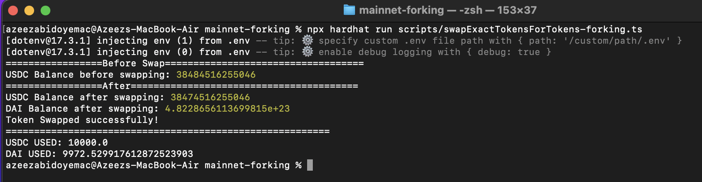
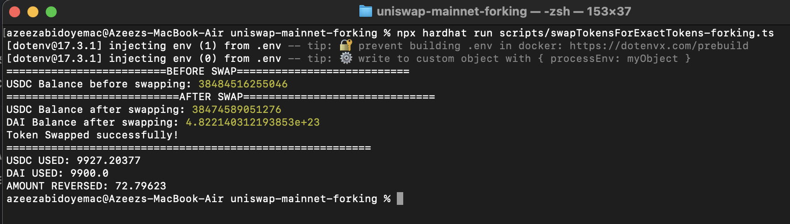

# UniSwap Mainnet Forking

### Scipted Functions

1. addLiquidity-forking ✅
2. swapETHForExactTokens-forking ✅
3. swapExactTokensForTokens-forking ✅
   
   4.swapTokensForExactTokens-forking ✅
   
